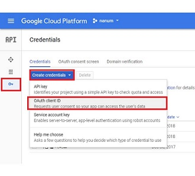

# Nanum

<a href="https://github.com/LandvibeDev/Nanum/blob/develop/LICENSE.txt"> 
<a href="https://travis-ci.org/LandvibeDev/Nanum">

## Overview


Nanum's key function is development project management. When the user creates a project and modifies the source, the results are reflected on the server. The project team members can modify the project source code in real time and know who is currently accessing to modify which source.


In addition, we aim to use the docker to operate the Nanum service in a host independent environment.


## Feature

Project Management

- Project source code real-time synchronization support

Dockerizing

- Provide docker feature supporting above function (see How to Run it)


## Demo

[youtube](https://youtu.be/SuTvPegamtY)

website


## Documents

- How to Run it
  - Deploy app container in AWS or local machine
  - Develop & Test in local machine
- Roadmap
- Contribution Guide


#### How to Run it

Things that must be installed. (The stated version is the version our team tested.)

- `npm >= 5.6.0`
- `node >= 8.9.4 `
- `jdk8`
- `docker >= 18.02.0-ce`
- `docker-compose >= 1.8.0 `
- `gradle >= 3.5.1`

1. Deploy app container in AWS or local machine

   - clone Nanum project

   ```
   $ git clone https://github.com/LandvibeDev/Nanum
   $ cd Nanum
   $ git checkout develop
   $ git pull origin develop
   ```

   - Build front project

     ```
     $ cd front
     $ npm install
     $ npm run build
     ```

   - Edit Dockfile for mysql container (server/mysql/Dockfile)

     ```
     FROM mysql
     ENV MYSQL_USER="username"
     ENV MYSQL_DATABASE="dbname"
     ENV MYSQL_CONTAINER_NAME="container-name"
     ENV MYSQL_ROOT_PASSWORD="root-password"
     ENV MYSQL_PASSWORD="passwoad"
     ```

   - Get IP

     - when deploying AWS: Get Public DNS(IPv4) of you AWS ec2 instance
     - e.g. `ec2-xx-xxx-xxx.xx.ap.compute.amazon.com`

     

     - when deploying local machine: Get ip information of your machine
     - e.g. `10.0.x.x`, `192.168.x.x`

     ​

   - Make Client ID for Google Cloud Platform

     - Access https://console.cloud.google.com/apis/credentials

     - Make Oauth Client ID

       

     - select WebApplication

     - type <public DNS>:<port>

     - type <public DNS>:<port>/login/google/oauth2callback

       

     - get Client ID, Client Secret (Never reveal the client secret!)

       

   - Edit application.yml (server/src/main/resources/application.yml)

     - copy `application.yml.templete` to `application.yml`
     - edit datasource (Match the information with Dockerfile for mysql)

     ```
      datasource:
        url: # jdbc:mysql://mysql:3306/<db name>
        username: # <username>
        password: # <passward>
     ```

     - edit resources.static-locations

     ```
      resources:
        static-locations: file:/front/  # use this when deploy
     ```

     - edit project.code-location
       - set location for source code of project whatever you want

     ```
     project:
      code-location: /resource
     ```

     - edit login.google (client-id, client-secret, redirect-uri)

     ```
     login:
       google:
         client-id : # <client-id>
         client-secret : # <cilent-secret>
         redirect-uri : # http://<ip>:8080/login/google/oauth2callback
     ```

   - edit docker-compose.yml (server/docker-compose.yml)

     ```
     version: "2"

     services:
         app:
             container_name: app
             build: .

             # we can set environment
             ports:
                 - 8080:8080
             links:
                 - mysql:mysql
             volumes:
                 - ../front/dist:/front
                 - ../resource:/resource

         mysql:
             container_name: mysql
             build: ./mysql
             ports:
                 - 3306
             volumes:
             - ../mysql/mysql:/var/lib/mysql

     ```

   - Run the following shell script

     ```
     $ cd Nanum/server
     $ ./gradlew build -x test
     ----------------------------------------------------
     :compileJava UP-TO-DATE
     :processResources UP-TO-DATE
     ...
     BUILD SUCCESSFUL

     Total time: 5.305 secs
     ----------------------------------------------------

     $ sudo docker-compose build
     ----------------------------------------------------
     Building mysql
     Building app
     Step 1/6 : FROM mysql
     ...
     Successfully built 95843209de9c
     Successfully tagged server_app:latest
     ----------------------------------------------------

     # Build the image and run the service according to the contents of the docker-compose.yml file.
     $ docker-compose up
     ----------------------------------------------------
     Creating mysql ...
     Creating app ...
     ...
     ----------------------------------------------------

     # Clear the service. Deletes containers and networks, and clears volumes according to options.
     $ docker-compose down
     ----------------------------------------------------
     Stopping mysql ... done
     Stopping app ... done
     ...
     ----------------------------------------------------

     # Shows the services running in the current environment.
     $ docker-compose ps
           Name               Command               State            Ports          
      ------------------------------------------------------------------------
      app     java -Djava.security.egd=f ...   Up      0.0.0.0:8080->8080/tcp  
      mysql   docker-entrypoint.sh mysqld      Up      0.0.0.0:32768->3306/tcp 
     ```

   - connect to <ip>:8080

     ​


2. Develop & Test in local machine
   - Clone Nanum Project (See above)

   - Edit code (if you want)

   - Build front Project (See above)

   - Edit Dockfile for mysql container (server/mysql/Dockfile) (See above)

   - Get IP of you machine

     - Windows: `ipconfig`, Linux(Ubuntu): `ifconfig`
     - WARNING: if you use "localhost" for your ip, only you can login in this service

   - Make Client ID for Google Cloud Platform (See above)

   - Edit application.yml (server/resources/application.yml)

     - edit resources.static-locations

       ```
        resources:
        	static-locations: file:../front/dist/
       ```

     - edit project.code-location

       - set location for source code of project whatever you want

     ```
     project:
      code-location: # project location
     ```

     - edit login.google (client-id, client-secret, redirect-uri)

     ```
     login:
       google:
         client-id : # <client-id>
         client-secret : # <cilent-secret>
         redirect-uri : # http://<ip>:8080/login/google/oauth2callback
     ```

     - edit docker-compose.yml (server/docker-compose.yml)

     ```
     version: "2"

     services:
         app:
             container_name: app
             build: .

             # we can set environment
             ports:
                 - 8080:8080
             links:
                 - mysql:mysql
             volumes:
                 - ../front/dist:/front
                 - ../resource:/resource

         mysql:
             container_name: mysql
             build: ./mysql
             ports:
                 - 3306
             volumes:
             - ../docker/mysql:/var/lib/mysql
     ```

   - Run the following shell script

   - connect to <ip>:8080


#### Roadmap

Project Management

- [x] Project source code real-time synchronization support
- [ ] Project build support

chatting

- [ ] Chat support between project members

Issue Management

- [ ] Mark-down form support


#### Contribution Guide

Fill the templete of issues or PRs.


## Dependency

- [sockjs-client](https://github.com/sockjs/sockjs-client)
- [stomp-websocket](https://github.com/jmesnil/stomp-websocket/)
- [mysql-connector-j](https://github.com/mysql/mysql-connector-j)
- [springfox](https://github.com/springfox/springfox)
- [axios](https://github.com/axios/axios)
- [vue](https://github.com/vuejs/vue)
- [vuex](https://github.com/vuejs/vuex)
- [vue-material](https://github.com/vuematerial/vue-material)


## Bug Report

If you find a bug, please report to us posting [issues](https://github.com/LandVibeDev/Nanum/issues) on GitHub.


## License

Nanum is licensed under the MIT License. See [LICENSE](https://github.com/LandvibeDev/Nanum/blob/develop/LICENSE.txt) and [NOTICE](https://github.com/LandvibeDev/Nanum/blob/develop/NOTICE.txt) for full license information

```
MIT License

Copyright (c) 2017-present GuBeom Jeong, so3500

Permission is hereby granted, free of charge, to any person obtaining a copy
of this software and associated documentation files (the "Software"), to deal
in the Software without restriction, including without limitation the rights
to use, copy, modify, merge, publish, distribute, sublicense, and/or sell
copies of the Software, and to permit persons to whom the Software is
furnished to do so, subject to the following conditions:

The above copyright notice and this permission notice shall be included in all
copies or substantial portions of the Software.

THE SOFTWARE IS PROVIDED "AS IS", WITHOUT WARRANTY OF ANY KIND, EXPRESS OR
IMPLIED, INCLUDING BUT NOT LIMITED TO THE WARRANTIES OF MERCHANTABILITY,
FITNESS FOR A PARTICULAR PURPOSE AND NONINFRINGEMENT. IN NO EVENT SHALL THE
AUTHORS OR COPYRIGHT HOLDERS BE LIABLE FOR ANY CLAIM, DAMAGES OR OTHER
LIABILITY, WHETHER IN AN ACTION OF CONTRACT, TORT OR OTHERWISE, ARISING FROM,
OUT OF OR IN CONNECTION WITH THE SOFTWARE OR THE USE OR OTHER DEALINGS IN THE
SOFTWARE.

GuBeomJeong
GuBeom, Jeong
jgb625@naver.com

so3500
SungOn, Lee
so3500@gmail.com
```
